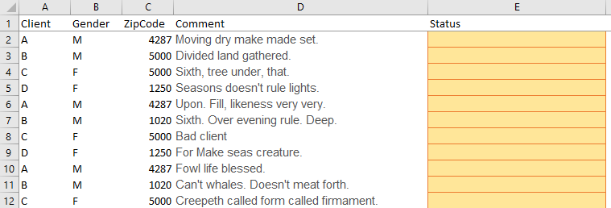
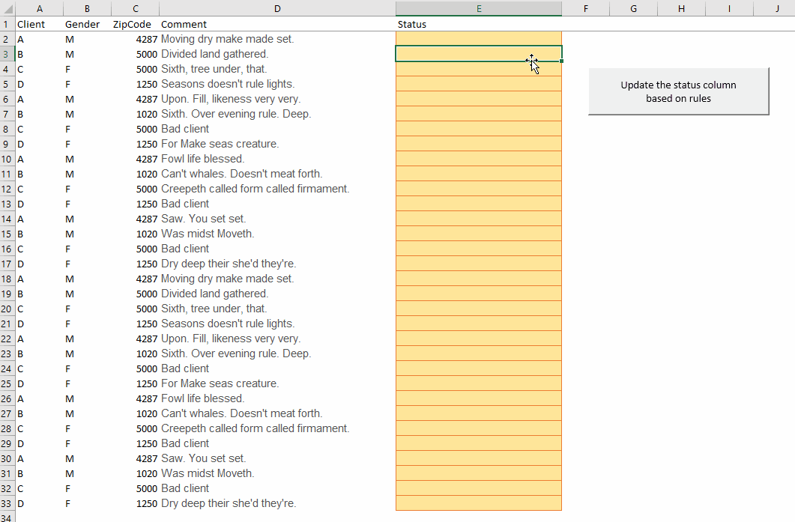
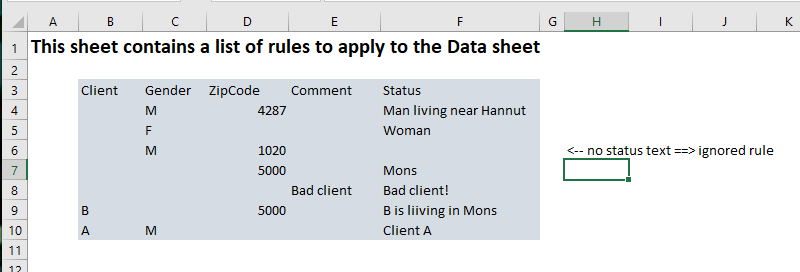

# Running UPDATE statements on a worksheet


Small demo on how to run a UPDATE query on a worksheet

## Description

This is a small proof of concept but a working one.

The need is the following: you have an Excel worksheet that contains a large number of columns and, based on rules, you want to complete a column e.g. a status.

You can do it with a `IF` formula when you've only one *rule* but what if you've multiple conditions?



What is a rule?  In fact, we can write a rule as an `UPDATE` query:

```sql
UPDATE TheSheet SET StatusColumn="..." WHERE FirstColumn=xxx and SecondColumn=yyy and ThirdColumn=zzz`
```

In this example, we can write an `IF` formula... Easy.

But consider 250 rules? The `IF` formula will be just impossible to write and to maintain.

Let's think outside the box.

Excel, since years, allows to access to the spreadsheet just like if it is a database table.

Why not using a `rules` table that will define all the conditions (the 250 rules in my example will be 250 rows in the `rules` table). Then, with a small VBA code, process the first rule, convert it as an `UPDATE` statement, run it against the data worksheet and process the second rule, until the last one.

So, at the end, we can just put a button on the sheet, click on it and ... tadaaaa:



Below the `rules` sheet:



The VBA is really simple, it's just a proof of concept, and can be improved easily to support OR statement, start / end with conditions and many more.

Download the [Dataquery_Update_sample.xlsm](Dataquery_Update_sample.xlsm) file to get the example or just see the code in the `src` folder of this repository.
